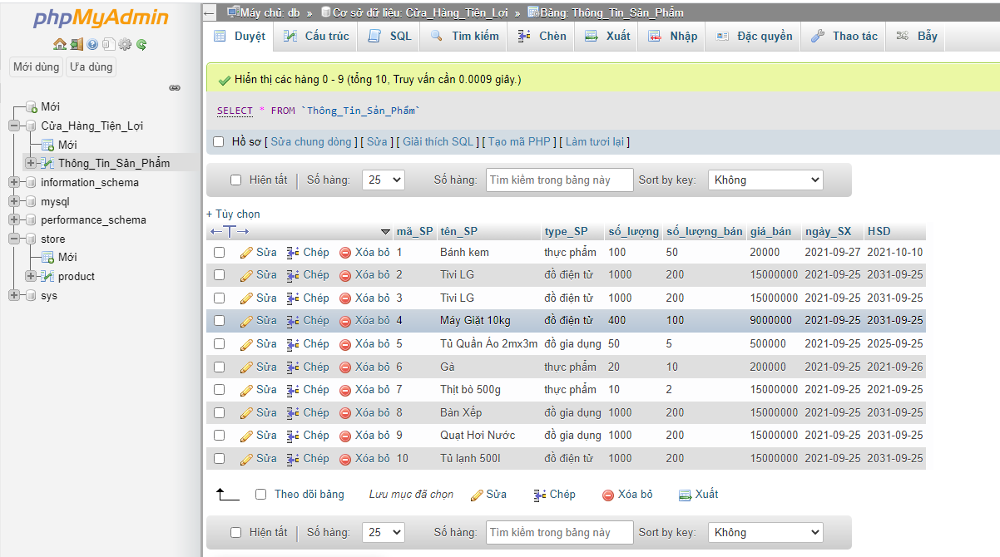

# Buổi 1 (BTVN)

Tạo database quản lý sản phẩm của một cửa hàng bao gồm:
```sql
Bảng sản phẩm để quản lý thông tin sản phẩm có các cột : mã sản phẩm, 
tên sản phẩm, loại sản phẩm (thực phẩm, đồ gia dụng, đồ điện tử, ...) số lượng, số lượng bán, giá bán, ngày sản xuất, hạn sử dụng
```
Lưu ý: Hãy chọn đúng kiểu dữ liệu cho các cột, được null hay không
Thực hiện thêm 5 sản phẩm vào bảng vừa tạo

## Bước 1: Tạo DATABASE 
  ```sql
  CREATE DATABASE Cửa_Hàng_Tiện_Lợi
  ```

## Bước 2 Tạo ra TABLE 
  ```sql
  CREATE TABLE Thông_Tin_Sản_Phẩm(
    mã_SP INT PRIMARY KEY,
    ten_SP TEXT NOT NULL,
    type_SP ENUM('thực phẩm', 'đồ gia dụng', 'đồ điện tử'),
    số_lượng INT,
    số_lượng_bán INT,
    giá_bán BIGINT,
    ngày_SX DATE,
    HSD DATE
  )
  ```

## Bước 3 Thêm sản phẩm vào bảng 
  ```sql
    INSERT INTO Thông_Tin_Sản_Phẩm(mã_SP,tên_SP,type_SP,số_lượng,số_lượng_bán,giá_bán,ngày_SX,HSD)
    VALUES(1,'Bánh kem', 'thực phẩm', 500, 102, 20000, '2021-09-27', '2021-10-10');

    ...
  ```
## Bước 4 Check kết quả ở phần Duyệt

  


