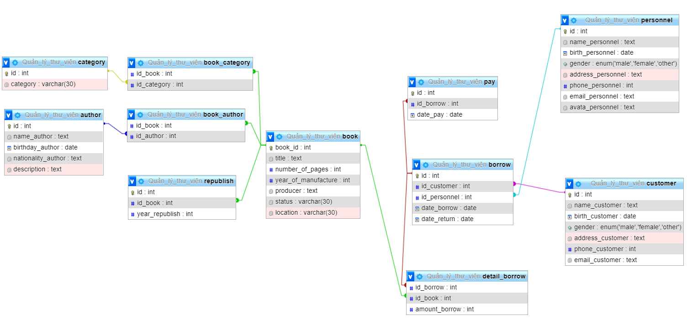

# Buổi 3: Xây dựng database quản lý thư viện:
- Bước 1: Tạo CREATE DATABASE Quản_lý_thư_viện
  ```sql
   CREATE DATABASE Quản_lý_thư_viện
  ```
- Bước 2: Sách(id, tên, số trang, thể loại, tác giả, năm xuất bản, nhà xuất bản, tính trạng, vị trí)
```sql
   CREATE TABLE book (
    book_id INT PRIMARY KEY AUTO_INCREMENT,
    title text not null,
    number_of_pagers int not null,
    year_of_manufacture int,
    producer text,
    status varchar(30),
    location varchar(30)
    )
  ```
- Bước 3 : Thể loại(id, tên thể loại)
```sql
   CREATE TABLE category (
    id INT PRIMARY KEY AUTO_INCREMENT,
    category VARCHAR(30)
    )
  ```
- Bước 4: Tạo sách_thể loại(id_sách, id_thể loại)
```sql
  CREATE TABLE book_category (
  id_book INT NOT null,
  id_category INT NOT null,
  FOREIGN KEY(id_book) REFERENCES book(book_id),
  FOREIGN KEY(id_category) REFERENCES category(id)
)
  ```
- Bước 5: Tác giả(id, tên , ngày sinh, quê quán, mô tả)
```sql
  CREATE TABLE author (
    id INT PRIMARY KEY AUTO_INCREMENT,
    name_author text NOT null,
    birthday_author date,
    nationality_author text,
    description text
)
  ```
- Bước 6: sách_tác giả (id sach, id tác giả)
```sql
  CREATE TABLE book_author (
  id_book INT NOT null,
  id_author INT NOT null,
  FOREIGN KEY(id_book) REFERENCES book(book_id),
  FOREIGN KEY(id_author) REFERENCES author(id)
)
  ```
- Bước 7: Tái bản(id, id_sách, năm)
```sql
  CREATE TABLE republish (
     id int PRIMARY KEY AUTO_INCREMENT, 
     id_book int not null,
     year_republish int not null, 
     FOREIGN KEY(id_book) REFERENCES book(book_id)
      );
  ```
  - Bước 8: Nhân viên(id, tên , ngày sinh, giới tính, địa chỉ, sđt, email, avatar)
```sql
  CREATE TABLE personnel (
	id int PRIMARY KEY AUTO_INCREMENT,
    name_personnel text NOT null,
    birth_personnel date,
    gender ENUM ('male' ,'female' ,'other'),
   	address_personnel text,
    phone_personnel int,
    email_personnel text,
    avata_personnel text
);
  ```
  - Bước 9: Độc giả(id, tên , ngày sinh, giới tính, địa chỉ, sđt, email)
```sql
  CREATE TABLE customer (
	id int PRIMARY KEY AUTO_INCREMENT,
    name_customer text NOT null,
    birth_customer date,
    gender ENUM ('male' ,'female' ,'other'),
   	address_customer text,
    phone_customer int,
    email_customer text
);
  ```

- Bước 10: Phiếu mượn(id, id_độc giả, id_nhan viên, ngày mượn, ngày hẹn trả )
```sql
  CREATE TABLE borrow (
	id int PRIMARY KEY AUTO_INCREMENT,
    id_customer int NOT null,
    id_personnel int NOT null,
    date_borrow Date,
    date_return Date,
    FOREIGN KEY (id_customer) REFERENCES customer(id),
    FOREIGN KEY (id_personnel) REFERENCES personnel(id)
);
  ```
- Bước 11: Chi tiết mượn(id_phiếu mượn, id sách, số lượng)
```sql
  CREATE TABLE detail_borrow(
	id_borrow int not null,
    id_book int not null,
    amount_borrow int not null,
    FOREIGN KEY (id_borrow) REFERENCES borrow(id),
    FOREIGN KEY (id_book) REFERENCES book(book_id)
);
  ```

- Bước 12: Phiếu trả(id, id phiếu mượn, ngày trả)
```sql
  CREATE TABLE pay (
	id int PRIMARY KEY AUTO_INCREMENT,
    id_borrow int not null,
    date_pay date,
    FOREIGN KEY (id_borrow) REFERENCES borrow(id)
);
  ```
- Bước 13: Kết quả
