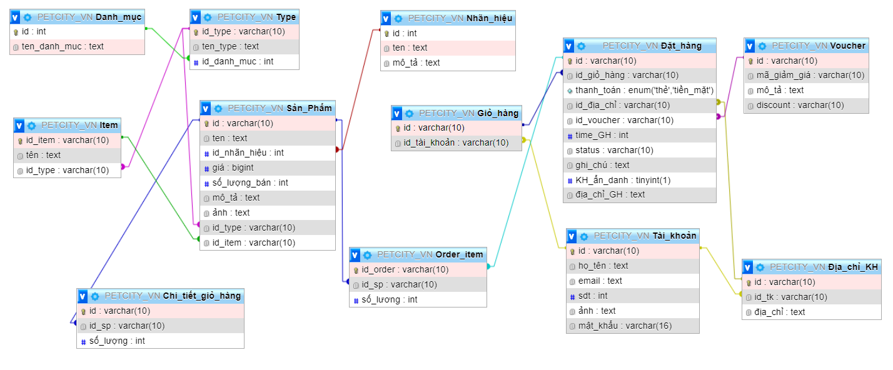

# Buổi 5: Phân tích trang web https://www.petcity.vn/
- Bước 1: tạo DataBase PETCITY_VN
```sql
CREATE DATABASE PETCITY_VN
```
- Bước 2:Danh mục(id, tên danh mục)
```sql
CREATE Table Danh_mục(
    id INT PRIMARY KEY,
    ten_danh_muc Text not null
)
```
- Bước 3:Type(id_type, tên_type, id_danh_mục)
```sql
CREATE Table Type(
    id_type varchar(10) PRIMARY KEY,
    ten_type Text not null,
    id_danh_muc int not null,
    FOREIGN KEY(id_danh_muc) REFERENCES Danh_mục(id)
)
```
- Bước 4: Item(id_item, tên , id_type)
```sql
CREATE Table Item(
    id_item varchar(10) PRIMARY KEY,
    tên Text not null,
    id_type varchar(10) not null,
    FOREIGN KEY(id_type) REFERENCES Type(id_type)
)
```
- Bước 5:Nhãn hiệu(id, tên, mô tả)
```sql
CREATE Table Nhãn_hiệu(
    id INT PRIMARY KEY,
    ten Text not null,
    mô_tả Text
)
```
 Bước 6: Sản phẩm (id, tên, id_nhãn hiệu, giá cả, số lượng người đã mua, mô tả, ảnh, id_type, id_item)
```sql
CREATE TABLE Sản_Phẩm(
  id varchar(10) PRIMARY KEY,
  ten TEXT NOT NULL,
  id_nhãn_hiệu INT NOT NULL,
  giá BIGINT NOT NULL,
  số_lượng_bán INT NOT NULL,
  mô_tả TEXT,
  ảnh TEXT,
  id_type varchar(10) NOT NULL,
  id_item varchar(10) NOT NULL,
  FOREIGN KEY(id_nhãn_hiệu) REFERENCES Nhãn_hiệu(id),
  FOREIGN KEY(id_type) REFERENCES Type(id_type),
  FOREIGN KEY(id_item) REFERENCES Item(id_item)
)
```
- Bước 7: tài khoản(id, họ tên, id_địa chỉ, email, sđt, ảnh, mật khẩu)
```sql
CREATE TABLE Tài_khoản(
  id varchar(10) PRIMARY KEY,
  họ_tên TEXT NOT NULL,
  email text not null,
  sdt int ,
  ảnh text,
  mật_khẩu varchar(16) not null,
)
```
- Bước 8: địa chỉ khách hàng (id, id_tk,sđt, địa chỉ)
```sql
CREATE Table Địa_chỉ_KH(
    id varchar(10) PRIMARY KEY,
    id_tk varchar(10) not null,
    địa_chỉ Text,
    FOREIGN KEY(id_tk) REFERENCES Tài_khoản(id)
)
```
- Bước 9:Giỏ hàng (id, id_tài khoản)
```sql
CREATE Table Giỏ_hàng(
    id varchar(10) PRIMARY KEY,
    id_tài_khoản varchar(10) not null,
    FOREIGN KEY(id_tài_khoản) REFERENCES Tài_khoản(id)
)
```
- Bước 10:chi tiết giỏ hàng (id, id sản phẩm, số lượng)
```sql
CREATE Table Chi_tiết_giỏ_hàng(
    id varchar(10) PRIMARY KEY,
    id_sp varchar(10) not null,
    số_lượng int not null,
    FOREIGN KEY(id_sp) REFERENCES Sản_Phẩm(id)
)
```
- Bước 11:voucher(id, mã giảm giá, mô tả, discount)
```sql
CREATE Table Voucher(
    id varchar(10) PRIMARY KEY,
    mã_giảm_giá varchar(10) not null,
    mô_tả text,
    discount varchar(10)
)
```
- Bước 12: Order (id, id giỏ hàng, hình thức thanh toán, id địa chỉ, id_voucher, Thời gian đặt hàng, status, ghi chú, is anonymous customer (boolean), địa chỉ giao hàng (json object))
```sql
CREATE Table Đặt_hàng(
    id varchar(10) PRIMARY KEY,
    id_giỏ_hàng varchar(10) not null,
    thanh_toán enum ('thẻ','tiền_mặt'),
    id_địa_chỉ varchar(10) not null,
    id_voucher varchar(10) not null,
    time_GH int not null,
    status varchar(10),
    ghi_chú text,
    KH_ẩn_danh boolean,
    địa_chỉ_GH text not null,
    FOREIGN KEY(id_giỏ_hàng) REFERENCES Giỏ_hàng(id),
    FOREIGN KEY(id_địa_chỉ) REFERENCES Địa_chỉ_KH(id),
    FOREIGN KEY(id_voucher) REFERENCES Voucher(id),
)
```
- Bước 13:order_item(id_order, id sản phẩm, số lượng)
```sql
CREATE Table Order_item(
    id_order varchar(10) PRIMARY KEY,
    id_sp varchar(10) not null,
    số_lương int not null,
    FOREIGN KEY(id_order) REFERENCES Đặt_hàng(id),
    FOREIGN KEY(id_sp) REFERENCES Sản_Phẩm(id)
)
```
# KẾT QUẢ 

# Thực hiện một số truy vấn
```sql
INSERT INTO Sản_Phẩm(id ,ten ,id_nhãn_hiệu ,giá ,số_lượng_bán ,mô_tả ,ảnh ,id_type,id_item)
  VALUES(1,'Chuông', '111', 50000, 100, 'Chuông chó/mèo', 'Chuông', '111','111');
INSERT INTO Sản_Phẩm(id ,ten ,id_nhãn_hiệu ,giá ,số_lượng_bán ,mô_tả ,ảnh ,id_type,id_item)
  VALUES(2,'Hạt', '222', 20000, 200, 'Hạt chó/mèo', 'Hạt', '222','222');
INSERT INTO Sản_Phẩm(id ,ten ,id_nhãn_hiệu ,giá ,số_lượng_bán ,mô_tả ,ảnh ,id_type,id_item)
  VALUES(3,'Nhà', '333', 300000, 50, 'Nhà chó/mèo', 'Nhà', '333','333');
INSERT INTO Sản_Phẩm(id ,ten ,id_nhãn_hiệu ,giá ,số_lượng_bán ,mô_tả ,ảnh ,id_type,id_item)
  VALUES(4,'Dây', '444', 100000, 400, 'Dây chó/mèo', 'Dây', '444','444');
INSERT INTO Sản_Phẩm(id ,ten ,id_nhãn_hiệu ,giá ,số_lượng_bán ,mô_tả ,ảnh ,id_type,id_item)
  VALUES(1,'Áo', '555', 50000, 100, 'Áo chó/mèo', 'Áo', '555','555')

```
+ lấy danh sách tất cả sản phẩm

