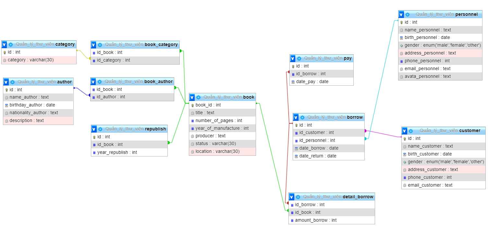
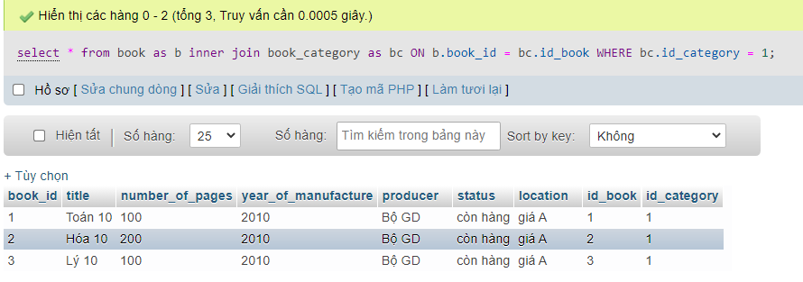
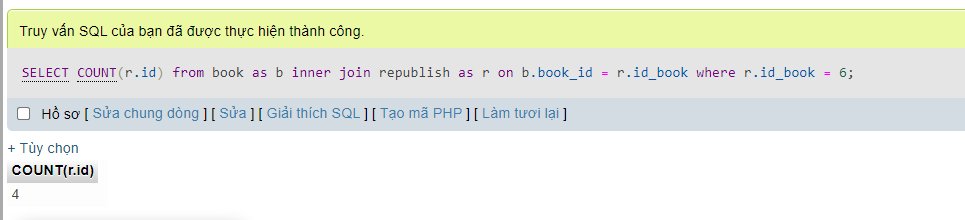

# Buổi 6 : Quản lý thư viện
## Viết các câu lệnh DDL
- Bước 1: Tạo CREATE DATABASE Quản_lý_thư_viện
  ```sql
   CREATE DATABASE Quản_lý_thư_viện
  ```
- Bước 2: Sách(id, tên, số trang, thể loại, tác giả, năm xuất bản, nhà xuất bản, tính trạng, vị trí)
```sql
   CREATE TABLE book (
    book_id INT PRIMARY KEY AUTO_INCREMENT,
    title text not null,
    number_of_pagers int not null,
    year_of_manufacture int,
    producer text,
    status varchar(30),
    location varchar(30)
    )
  ```
- Bước 3 : Thể loại(id, tên thể loại)
```sql
   CREATE TABLE category (
    id INT PRIMARY KEY AUTO_INCREMENT,
    category VARCHAR(30)
    )
  ```
- Bước 4: Tạo sách_thể loại(id_sách, id_thể loại)
```sql
  CREATE TABLE book_category (
  id_book INT NOT null,
  id_category INT NOT null,
  FOREIGN KEY(id_book) REFERENCES book(book_id),
  FOREIGN KEY(id_category) REFERENCES category(id)
)
  ```
- Bước 5: Tác giả(id, tên , ngày sinh, quê quán, mô tả)
```sql
  CREATE TABLE author (
    id INT PRIMARY KEY AUTO_INCREMENT,
    name_author text NOT null,
    birthday_author date,
    nationality_author text,
    description text
)
  ```
- Bước 6: sách_tác giả (id sach, id tác giả)
```sql
  CREATE TABLE book_author (
  id_book INT NOT null,
  id_author INT NOT null,
  FOREIGN KEY(id_book) REFERENCES book(book_id),
  FOREIGN KEY(id_author) REFERENCES author(id)
)
  ```
- Bước 7: Tái bản(id, id_sách, năm)
```sql
  CREATE TABLE republish (
     id int PRIMARY KEY AUTO_INCREMENT, 
     id_book int not null,
     year_republish int not null, 
     FOREIGN KEY(id_book) REFERENCES book(book_id)
      );
  ```
  - Bước 8: Nhân viên(id, tên , ngày sinh, giới tính, địa chỉ, sđt, email, avatar)
```sql
  CREATE TABLE personnel (
	id int PRIMARY KEY AUTO_INCREMENT,
    name_personnel text NOT null,
    birth_personnel date,
    gender ENUM ('male' ,'female' ,'other'),
   	address_personnel text,
    phone_personnel int,
    email_personnel text,
    avata_personnel text
);
  ```
  - Bước 9: Độc giả(id, tên , ngày sinh, giới tính, địa chỉ, sđt, email)
```sql
  CREATE TABLE customer (
	id int PRIMARY KEY AUTO_INCREMENT,
    name_customer text NOT null,
    birth_customer date,
    gender ENUM ('male' ,'female' ,'other'),
   	address_customer text,
    phone_customer int,
    email_customer text
);
  ```

- Bước 10: Phiếu mượn(id, id_độc giả, id_nhan viên, ngày mượn, ngày hẹn trả )
```sql
  CREATE TABLE borrow (
	id int PRIMARY KEY AUTO_INCREMENT,
    id_customer int NOT null,
    id_personnel int NOT null,
    date_borrow Date,
    date_return Date,
    FOREIGN KEY (id_customer) REFERENCES customer(id),
    FOREIGN KEY (id_personnel) REFERENCES personnel(id)
);
  ```
- Bước 11: Chi tiết mượn(id_phiếu mượn, id sách, số lượng)
```sql
  CREATE TABLE detail_borrow(
	id_borrow int not null,
    id_book int not null,
    amount_borrow int not null,
    FOREIGN KEY (id_borrow) REFERENCES borrow(id),
    FOREIGN KEY (id_book) REFERENCES book(book_id)
);
  ```

- Bước 12: Phiếu trả(id, id phiếu mượn, ngày trả)
```sql
  CREATE TABLE pay (
	id int PRIMARY KEY AUTO_INCREMENT,
    id_borrow int not null,
    date_pay date,
    FOREIGN KEY (id_borrow) REFERENCES borrow(id)
);
  ```
- Bước 13: Kết quả


## Thêm dữ liệu vào bảng
- thêm sách
```sql
INSERT INTO book (`book_id`,`title`,`number_of_pages`,`year_of_manufacture`,`producer`,`status`,`location`)
VALUES (1,'Toán 10',100,2010,'Bộ GD','còn hàng','giá A');
...
INSERT INTO book (`book_id`,`title`,`number_of_pages`,`year_of_manufacture`,`producer`,`status`,`location`)
VALUES (4,'DOREMON',100,2010,'Kim Đồng','còn hàng','giá B');
INSERT INTO book (`book_id`,`title`,`number_of_pages`,`year_of_manufacture`,`producer`,`status`,`location`)
VALUES (5,'CONAN',100,2010,'Kim Đồng','còn hàng','giá B');
INSERT INTO book (`book_id`,`title`,`number_of_pages`,`year_of_manufacture`,`producer`,`status`,`location`)
VALUES (6,'NARUTO',100,2010,'Kim Đồng','còn hàng','giá B');
```
- thêm tác giả
```sql
INSERT INTO `category`(`id`, `category`)
VALUES (1,'SGK');
INSERT INTO `category`(`id`, `category`)
VALUES (2,'Truyện Tranh');
```
- thêm sách_thể loại
```sql
INSERT INTO book_category(`id_book`,`id_category`)
VALUES (1,1);
INSERT INTO book_category(`id_book`,`id_category`)
VALUES (2,1);
INSERT INTO book_category(`id_book`,`id_category`)
VALUES (3,1);
INSERT INTO book_category(`id_book`,`id_category`)
VALUES (4,2);
INSERT INTO book_category(`id_book`,`id_category`)
VALUES (5,2);
INSERT INTO book_category(`id_book`,`id_category`)
VALUES (6,2);
```
-thêm tái bản cho sách có book_id = 6
```sql
INSERT INTO republish (`id`,`id_book`,`year_republish`)
VALUES (6,6,2011);
INSERT INTO republish (`id`,`id_book`,`year_republish`)
VALUES (5,6,2013);
INSERT INTO republish (`id`,`id_book`,`year_republish`)
VALUES (4,6,2015);
INSERT INTO republish (`id`,`id_book`,`year_republish`)
VALUES (3,6,2017);
```
- thêm DS độc giả 
```sql
INSERT INTO customer (`id`,`name_customer`,`birth_customer`,`gender`,`address_customer`,`phone_customer`,`email_customer`)
VALUES (1,'Đinh Thế Vũ','1993-1-1','male','Hà Đông',113,'vu@gmail.com');
INSERT INTO customer (`id`,`name_customer`,`birth_customer`,`gender`,`address_customer`,`phone_customer`,`email_customer`)
VALUES (2,'Đào Ngọc Tùng','1995-1-1','male','Thanh Xuân',114,'tung@gmail.com');
INSERT INTO customer (`id`,`name_customer`,`birth_customer`,`gender`,`address_customer`,`phone_customer`,`email_customer`)
VALUES (3,'Trần Thị Hoa','1994-1-1','female','Cầu Giấy',115,'hoa@gmail.com');
```
- Thêm Nhân viên
```sql
INSERT INTO personnel (`id`,`name_personnel`,`birth_personnel`,`gender`,`address_personnel`,`phone_personnel`,`email_personnel`,`avata_personnel`)
VALUES (1,'Vũ Chính','1996-1-1','male','Tây Hồ',112,'chinh@gmail.com','vũ_dz')
```
- Thêm Phiếu mượn
```sql
INSERT INTO borrow (`id`,`id_customer`,`id_personnel`,`date_borrow`,`date_return`)
VALUES (1,1,1,'2021-10-1','2021-10-6');
INSERT INTO borrow (`id`,`id_customer`,`id_personnel`,`date_borrow`,`date_return`)
VALUES (2,2,1,'2021-10-1','2021-10-8');
INSERT INTO borrow (`id`,`id_customer`,`id_personnel`,`date_borrow`,`date_return`)
VALUES (3,3,1,'2021-10-1','2021-10-5');
```
- Thêm phiếu trả
```sql
INSERT INTO pay (`id`,`id_borrow`)
VALUES (1,1);
INSERT INTO pay (`id`,`id_borrow`,`date_pay`)
VALUES (2,2,'2021-10-8');
INSERT INTO pay (`id`,`id_borrow`)
VALUES (3,3)
```
- Thêm chi tiết mượn
```sql
INSERT INTO detail_borrow (`id_borrow`,`id_book`,`amount_borrow`)
VALUES (1,2,1);
INSERT INTO detail_borrow (`id_borrow`,`id_book`,`amount_borrow`) 
VALUES (2,4,1);
INSERT INTO detail_borrow (`id_borrow`,`id_book`,`amount_borrow`)
VALUES (3,6,1);
```
## Thực hiện các truy vấn 
- Liệt kê danh sách độc giả đang mượn sách
```sql
select *
from customer as c inner join borrow as b INNER JOIN pay as p
ON c.id = b.id_customer
And b.id = p.id_borrow
WHERE p.date_pay  IS NULL
```

- Liệt kê các quyển sách thuộc thể loại bất kỳ (vd thể loại có id = 1)
```sql
select *
from book as b inner join book_category as bc
ON b.book_id = bc.id_book
WHERE bc.id_category = 1
```


- Đưa ra số lần tái bản của quyển sách book_id = 6
```sql
SELECT COUNT(r.id)
from book as b inner join republish as r
on b.id = r.id_book
where r.id_book = 6
```

- Liệt kê thông tin các độc giả mượn sách nhưng quá hạn trả và id, tên của quyển sách mà độc giả đó đang mượn (Gợi ý sử dụng DATEDIFF)
```sql
SELECT customer.id AS id_KH,
customer.name_customer AS ten,
customer.gender AS gioi_tinh,
customer.phone_customer as sdt,
customer.email_customer as email,
borrow.date_borrow as ngay_muon,
borrow.date_return as ngay_hen_tra,
book.book_id AS id_sach,
book.title AS ten_sach,
detail_borrow.amount_borrow as soluong,
datediff(CURRENT_DATE,borrow.date_return) as so_ngay_qua_han 
FROM customer INNER JOIN borrow INNER JOIN detail_borrow INNER JOIN pay INNER JOIN book
ON customer.id = borrow.id_customer
and book.book_id = detail_borrow.id_book
and detail_borrow.id_borrow = borrow.id
and borrow.id = pay.id_borrow

WHERE  datediff(CURRENT_DATE,borrow.date_return)>0
and pay.date_pay is null
```


